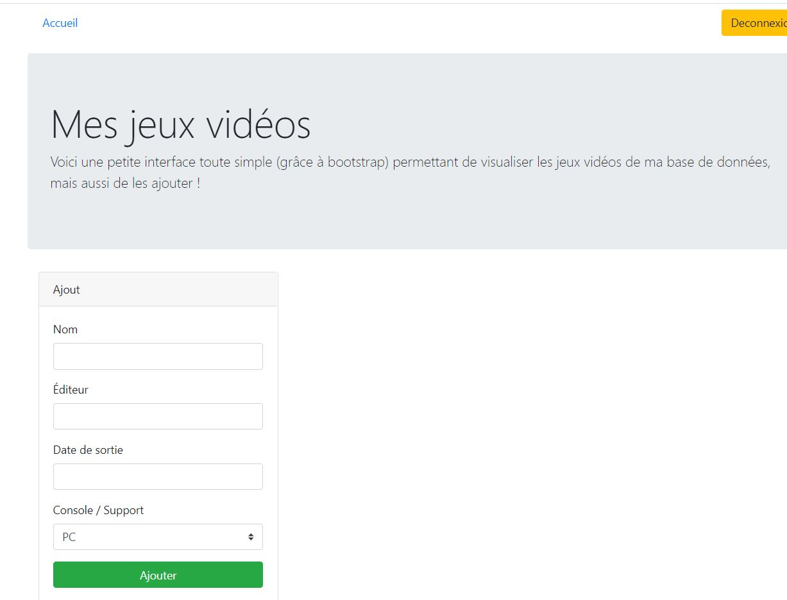

# VIDEOGAME

## Projet avec Lumen
Mon organisme de formation O'clock m'a fourni le code HTML BOOTSTRAP me permettant de gérer mes jeux vidéo. Elle est sympa. Merci  :wink:  
Elle m'a confiée la partie dynamique  

Objectifs :
- Installer Lumen :heavy_check_mark:
- Configurer :heavy_check_mark:
- Activer Eloquent
- Créer la BDD :heavy_check_mark:
- Créer les pages : :heavy_check_mark:
    - 1 page affichant les jeux et une page affichant le formulaire d'ajout
    - Factoriser le code HTML (layout header et footer) :heavy_check_mark:
    - Créer l'architecture MVC (Modèle Vue Controleur) :heavy_check_mark:
- Affichez les jeux video :heavy_check_mark:
- Listez les plateformes (consoles de jeu) en dynamique :heavy_check_mark:
- Avoir cohérence entre les 2 tables pour récupérer le nom des plateformes en rapport à leur ID 
- Triez cette liste :heavy_check_mark:  

### Sécurité
- Inscription :heavy_check_mark:
- Authentification :heavy_check_mark:
- La SESSION :heavy_check_mark:
- Deconnexion :heavy_check_mark:
- Créer et gerer les rôles (user et admin):heavy_check_mark:
- Gérer les accès sur la page admin :heavy_check_mark:

  

![Page]picture/capture.JPG)
